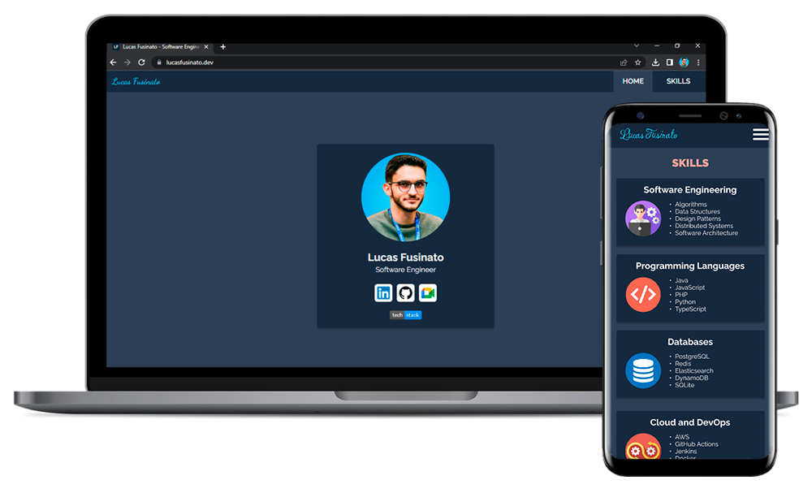

# 🌐 Lucas Fusinato - Website

My online portfolio as a Software Engineer. Check it in [lucasfusinato.dev](https://lucasfusinato.dev).

## Built with

- [TypeScript](https://www.typescriptlang.org/): statically typed JavaScript superset;
- [React.js](https://react.dev/): efficient component-based UI library;
- [Next.js](https://nextjs.org/): server-side rendering framework for React;
- [Tailwind CSS](https://tailwindcss.com/): utility-first CSS framework for styling;
- [ESLint](https://eslint.org/): code quality and style enforcement;
- [Vercel](https://vercel.com/): cloud platform for deploying web applications.
